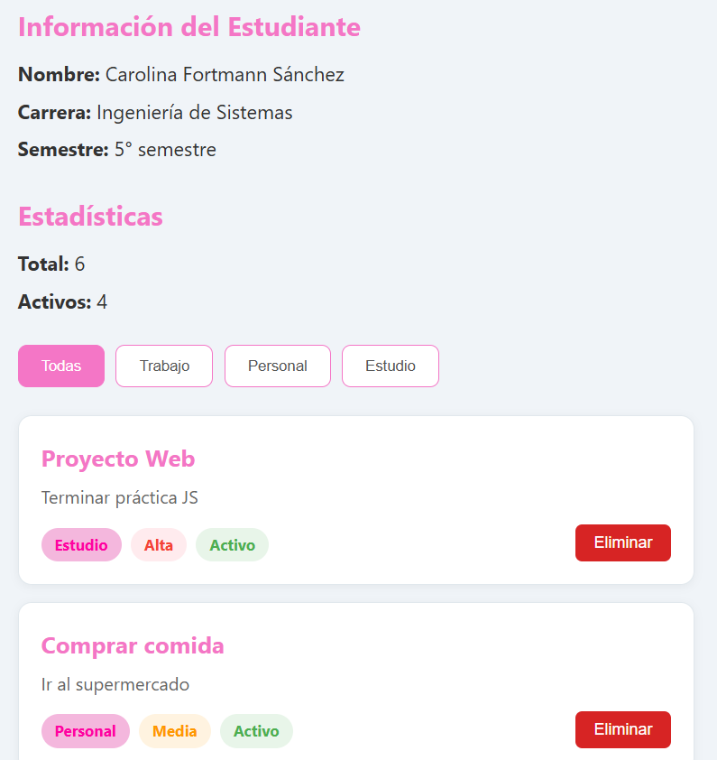
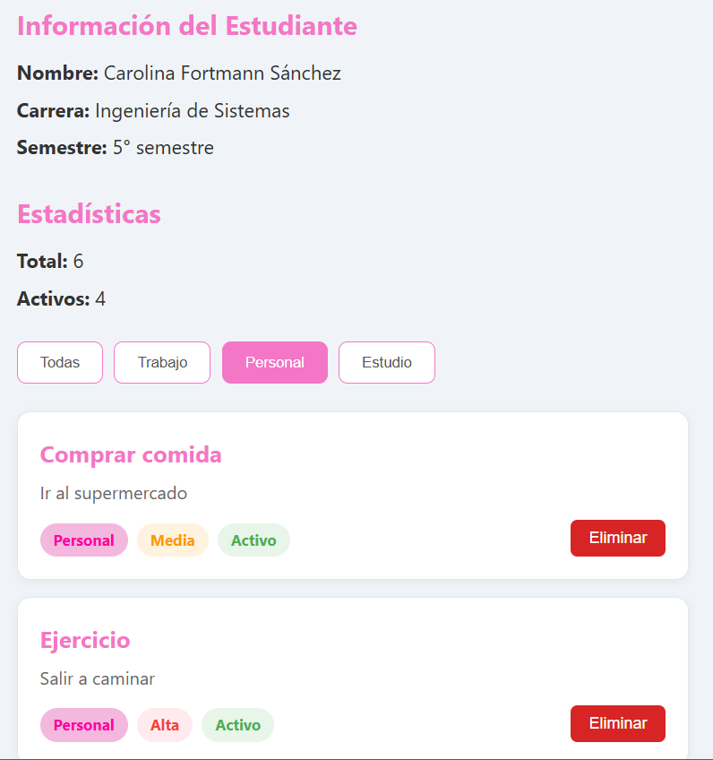

## PRÁCTICA 2
#### Carolina Fortmann
#### Código de CSS:
```css
body {
    font-family: 'Segoe UI', Tahoma, Geneva, Verdana, sans-serif;
    background-color: #f0f4f8;
    color: #333;
    line-height: 1.6;
    padding: 20px;
    max-width: 600px;
    margin: 0 auto;
}

/* Encabezados */
h2 {
    color: rgb(244, 118, 198); 
    margin-bottom: 10px;
    font-size: 1.5rem;
}

.info-estudiante, .estadisticas {
    margin-bottom: 25px;
}

.info-estudiante p, .estadisticas p {
    margin: 5px 0;
    font-size: 1.1rem;
}

/* Filtros de Botones */
.filtros {
    display: flex;
    gap: 10px;
    margin-bottom: 25px;
}

.btn-filtro {
    padding: 10px 20px;
    border: 1px solid rgb(244, 118, 198);
    background-color: white;
    border-radius: 8px;
    cursor: pointer;
    font-weight: 500;
    transition: all 0.3s ease;
    color: #555;
}

.btn-filtro:hover {
    transform: translateY(-5px); 
    box-shadow: 0 8px 16px rgba(0, 0, 0, 0.2); 
    background-color: rgb(244, 118, 198);
}

.btn-filtro-activo {
    background-color: rgb(244, 118, 198);
    color: white;
    border-color: rgb(244, 118, 198);
}

/* Contenedor principal de la lista - Flexbox */
#contenedor-lista {
    display: flex;
    flex-direction: column;
}

/* Cards */
.card {
    background: white;
    border-radius: 12px;
    border: 1px solid rgb(244, 118, 198);
    padding: 20px;
    margin-bottom: 15px;
    box-shadow: 0 2px 8px rgba(0,0,0,0.05);
    border: 1px solid #e1e8ed;
    position: relative;
}

.card:hover {
    transform: translateY(-5px); 
    box-shadow: 0 8px 16px rgba(0, 0, 0, 0.2); 
    border-color: rgb(244, 118, 198); 
}

.card h3 {
    margin: 0 0 5px 0;
    color: rgb(244, 118, 198);
    font-size: 1.3rem;
}

.card p {
    margin: 0 0 15px 0;
    color: #666;
}

/* Etiquetas */
.badges {
    display: flex;
    gap: 8px;
}

.badge {
    padding: 4px 12px;
    border-radius: 20px;
    font-size: 0.85rem;
    font-weight: bold;
}

/* Colores de las etiquetas */
.badge-categoria {
    background-color: rgb(244, 183, 221);
    color: rgb(255, 2, 162);
}

.prioridad-alta {
    background-color: #ffebee;
    color: #f44336;
}

.prioridad-media {
    background-color: #fff3e0;
    color: #ff9800;
}

.prioridad-baja {
    background-color: #e8f5e9;
    color: #4caf50;
}

.estado-activo {
    background-color: #e8f5e9;
    color: #4caf50;
}

.estado-inactivo {
    background-color: #f5f5f5;
    color: #9e9e9e;
}

/* Botón eliminar */
.card-actions {
    position: absolute;
    bottom: 20px;
    right: 20px;
}

.btn-eliminar {
    background-color: rgb(215, 36, 36);
    color: white;
    border: none;
    padding: 8px 16px;
    border-radius: 6px;
    cursor: pointer;
    font-size: 0.9rem;
    transition: background 0.2s;
}

.btn-eliminar:hover {
    transform: translateY(-5px); 
    box-shadow: 0 8px 16px rgba(0, 0, 0, 0.2); 
    background-color: rgb(183, 40, 40); 
}
```
### Estilos importantes:
#### - Layout con CSS Grid o Flexbox para las tarjetas
```css
#contenedor-lista {
    display: flex;
    flex-direction: column;
}
```
*Se usa Flexbox.*

#### - Hover effects en las tarjetas
```css
.btn-filtro:hover {
    transform: translateY(-5px); 
    box-shadow: 0 8px 16px rgba(0, 0, 0, 0.2); 
    background-color: rgb(244, 118, 198);
}

.card:hover {
    transform: translateY(-5px); 
    box-shadow: 0 8px 16px rgba(0, 0, 0, 0.2); 
    border-color: rgb(244, 118, 198); 
}

.btn-eliminar:hover {
    transform: translateY(-5px); 
    box-shadow: 0 8px 16px rgba(0, 0, 0, 0.2); 
    background-color: rgb(183, 40, 40); 
}
```
*Cada vez que el mouse o el foco se encuentre sobre un elemento, este se expande levemente para saber que se está sobre este.*
#### - Boton de eliminar con color rojo
```css
.btn-eliminar {
    background-color: rgb(215, 36, 36);
    color: white;
    border: none;
    padding: 8px 16px;
    border-radius: 6px;
    cursor: pointer;
    font-size: 0.9rem;
    transition: background 0.2s;
}
```
*El botón eliminar se pone de color rojo gracias a "background-color:"*
#### - Filtros activos resaltados
```css
.btn-filtro-activo {
    
    background-color: rgb(244, 118, 198);
    color: white;
    border-color: rgb(244, 118, 198);
}
```
*Se intercambian los colores de los filtros cuando el usuario hace click en el.*

### Imágenes:
#### 1- Vista general de la aplicación:

#### 2- Filtrado aplicado:
