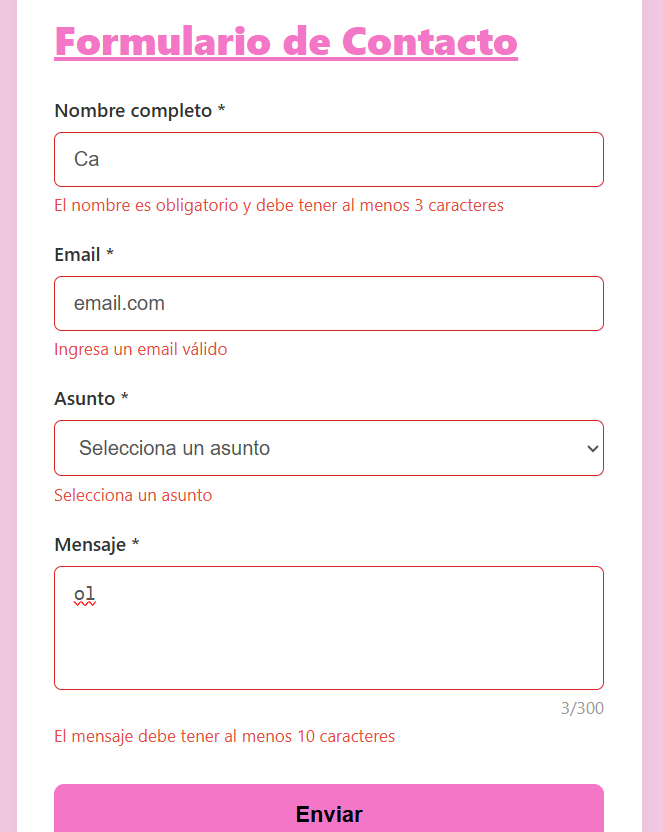
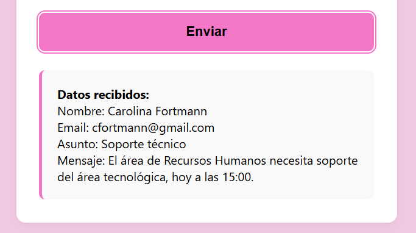
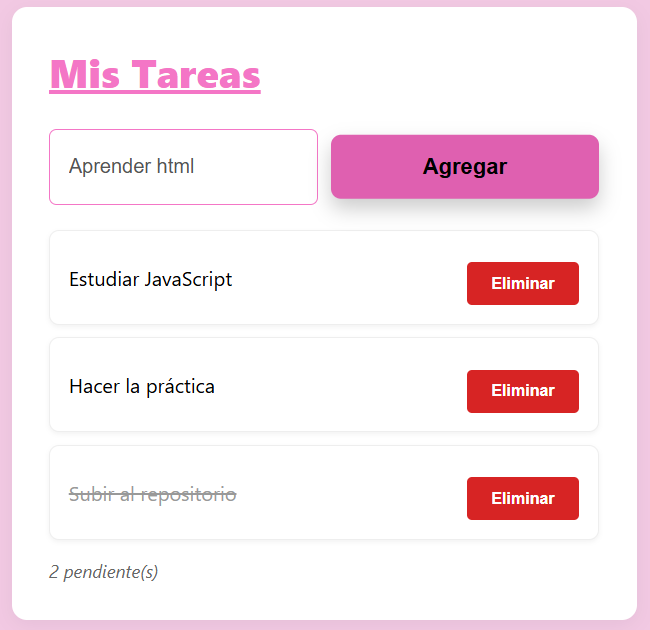
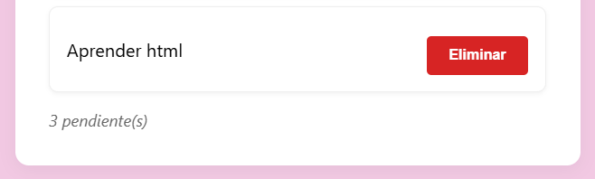
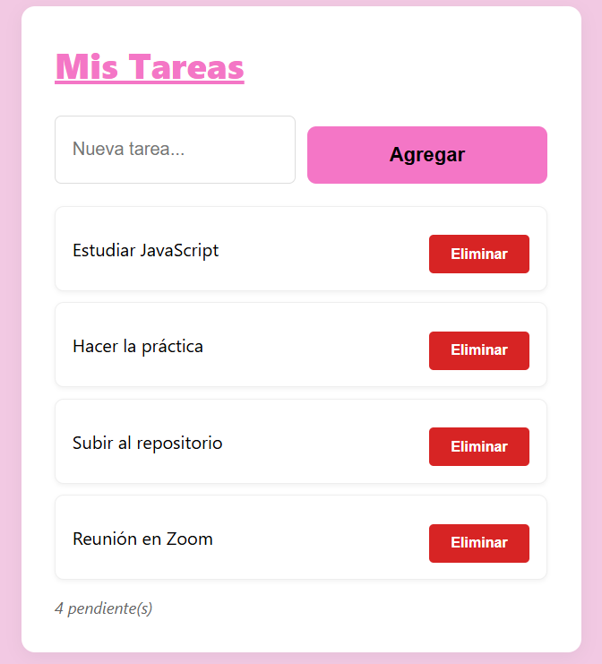
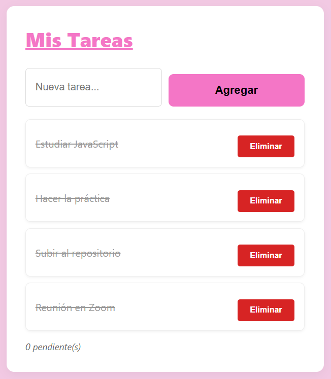

## PRÁCTICA 3
#### Carolina Fortmann
### Código destacado:
#### - Validación de formulario con ```preventDefault()```
```js
formulario.addEventListener('submit', (e) => {
    e.preventDefault();
    const nombreValido = validarNombre();
    const emailValido = validarEmail();
    const asuntoValido = validarAsunto();
    const mensajeValido = validarMensaje();
    if (nombreValido && emailValido && asuntoValido && mensajeValido) {
        mostrarResultado();
        resetearFormulario();
        return;
    }

    if (!nombreValido) {
        inputNombre.focus();
        return;
    }
    if (!emailValido) {
        inputEmail.focus();
        return;
    }
    if (!asuntoValido) {
        selectAsunto.focus();
        return;
    }
    textMensaje.focus();
});
```
*Esta funcionalidad se encarga de detener el envío automático del formulario (que recargaría la página) para permitir que el código valide los datos primero.*
#### - Event delegation en la lista de tareas
```js
listaTareas.addEventListener('click', (e) => {
    const action = e.target.dataset.action;
    if (!action) {
        return;  
    }

    const item = e.target.closest('li');
    if (!item || !item.dataset.id) {
        return;  
    }

    const id = Number(item.dataset.id);
    if (action === 'eliminar') {
        tareas = tareas.filter((tarea) => tarea.id !== id);
        renderizarTareas();
        return;  
    }

    if (action === 'toggle') {
        const tarea = tareas.find((itemTarea) => itemTarea.id === id);
        if (tarea) {
            tarea.completada = !tarea.completada;  
            renderizarTareas();
        }
    }
});
```

#### - Atajo de teclado con Ctrl+Enter
```js
document.addEventListener('keydown', (e) => {
    if (e.ctrlKey && e.key === 'Enter') {
        e.preventDefault()
        formulario.requestSubmit()
    }
});
```
### Imágenes:
#### 1- Validación en acción:


*Se observa cómo las validaciones están correctas. No se acepta un "nombre" de 2 caracteres, tampoco un email sin "@", un asunto vacío y un mensaje de menos de 10 caracteres.*
#### 2- Formulario procesado:


*Una vez se hace click en el botón de Enviar, los datos almacenados se muestran en un recuadro en la parte inferior del botón.*
#### 3- Event delegation funcionando:


*Al hacer click en el botón agregar, el evento no se detiene ahí, si no que este sube a su contenedor padre para registrar ese click y conocer qué evento se produjo*



*Como resultado, la nueva tarea se agrega a la lista y se podrá tachar o eliminar.*
#### 4- Contador de tareas actualizado:


*Se observa el contador de tareas en la parte inferior, tras el último contenedor de la tarea. Este contador se actualiza dependiendo si se añaden más tareas o si ya se ha realizado alguna.*
#### 5- Tareas completadas:


*Al hacer click sobre el label, se da por "finalizada" la tarea. Esto se refleja porque se "tacha" la palabra. A la misma vez,el contador se actualiza.*