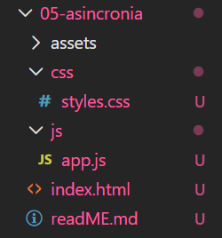
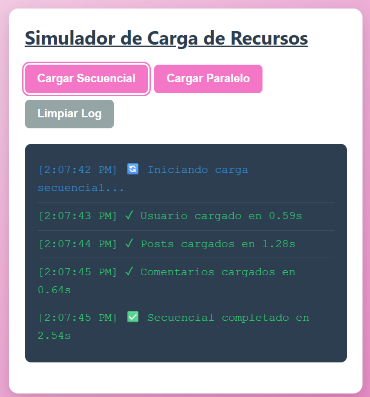
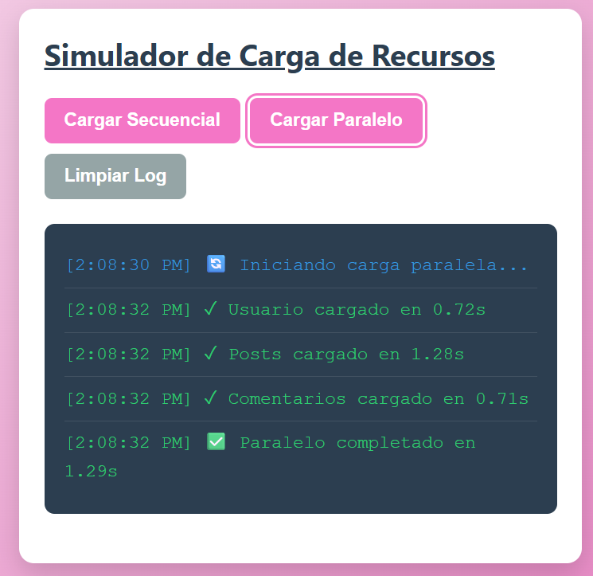
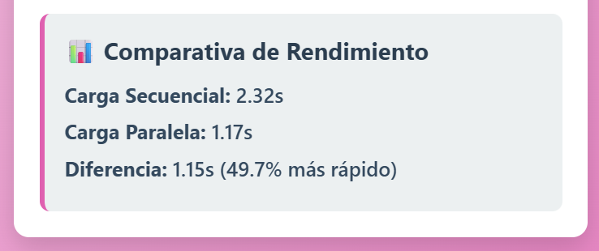
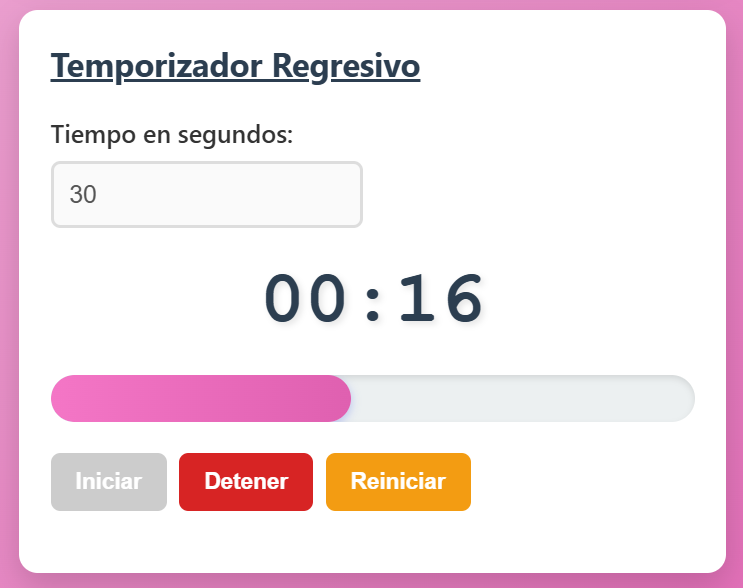
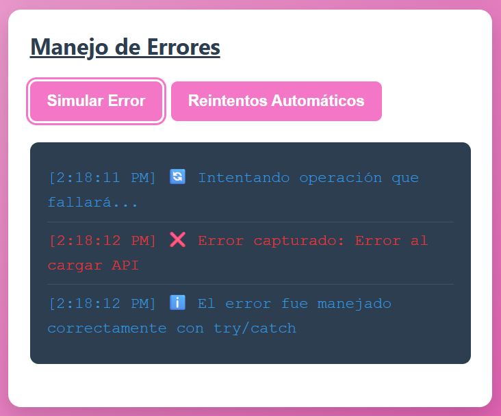
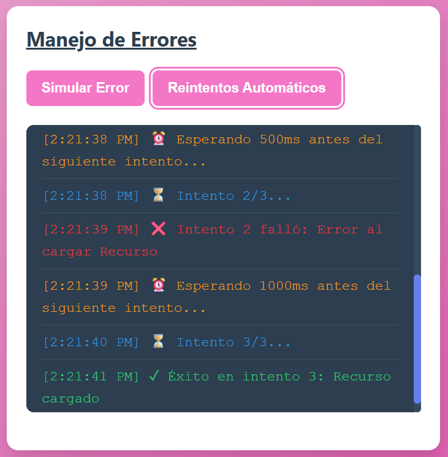
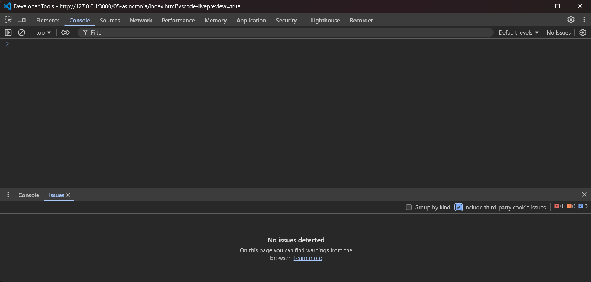
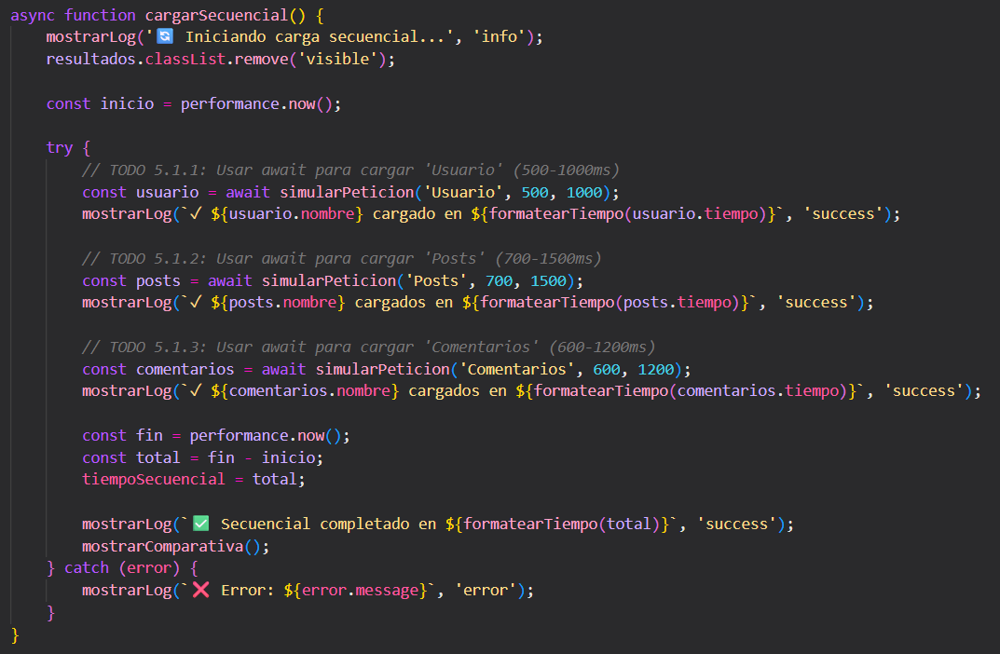
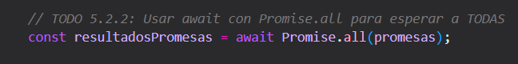

## PRÁCTICA 5
#### Carolina Fortmann
### Descripción del sistema:
El sistema está programado para realizar 3 funciones diferentes, demostrando el uso de los métodos de asincronía.
El primer simulador se encarga de recargar recursos de dos distintas formas y las compara. La carga secuencial obtiene datos uno tras otro, mientras que la carga paralela lanza las peticiones al mismo tiempo.
El segundo simulador es un cronómetro que utiliza el setInterval, de esta forma se puede iniciar, detener y reiniciar la cuenta regresiva. Cuando el temporizador llega a los 10 segundos, cambia la tonalidad como alerta para el usuario.
Por último, el tercer simulador gestiona errores y resilencia. Este muestra cómo hacer que una aplicación sea resistente ante fallos. Se implementa el try/catch para capturar errores, en este caso simulados, y para que el sistema no se detenga cuando la petición falla. 
### Código destacado:
#### - Función que retorna promesa con ```setTimeout()```
```js
setTimeout(() => {
            if (fallar) {
                reject(new Error(`Error al cargar ${nombre}`));
            } else {
                resolve({
                    nombre,
                    tiempo: tiempoDelay,
                    timestamp: new Date().toLocaleTimeString()
                });
            }
        }, tiempoDelay);
```
Se encuentra en el simulador de peticiones. Es la función encargada de simular la latencia de red (como un servidor) y esta se maneja luego con ```async/await```.

#### - Carga Paralela con ```Promise.all()```
```js
const resultadosPromesas = await Promise.all(promesas);
```
Dentro de la función ```cargarParalelo()```, esta función dispara promeasas simultáneamente. Posteriormente con ``` await Promise.all()``` se pausa la ejecución hasta que todas se resuelvan, falla si alguna falla.

#### - Manejo de errores con ```try/catch```
```js
async function simularError() {
    mostrarLogError('🔄 Intentando operación que fallará...', 'info');
    try {
        await simularPeticion('API', 500, 1000, true);
        mostrarLogError('✓ Operación exitosa', 'success');
    } catch (error) {
        mostrarLogError(`❌ Error capturado: ${error.message}`, 'error');
        mostrarLogError('ℹ️ El error fue manejado correctamente con try/catch', 'info');
    }
}
```
Se utiliza para gestionar excepciones en código asíncrono. El bloque ```try``` contiene el código que podría fallar, es decir, una petición. En el caso de que ocurra un error, el flujo salta inmediatamente al bloque ```catch```. Esto evita que la aplicación se detenga ante un fallo, permitiendo capturar el mensaje de error y mostrarlo al usuario.

#### - Temporizador con ```setInterval()```
```js
intervaloId = setInterval(() => {
    tiempoRestante--;
    actualizarDisplay();
    if (tiempoRestante <= 0) {
        detener();
        display.classList.add('alerta');
        alert('⏰ ¡Tiempo terminado!');
    }
}, 1000);
```
Se encuentra en la función ```iniciar()``` del temporizador. Este método permite crear una cuenta regresiva en tiempo real, mediante los valores especificados en la función. Se detiene mediante la función ```clearInterval(intervaloId)``` cuando el tiempo llega a cero o el usuario presiona el botón *"Detener"*.

### Imágenes:
#### 1- Estructura del proyecto:


#### 2- Carga secuencial:

*Al hacer Click en Cargar Secuencial muestra en el log cómo funciona; envía las peticiones una por una. Hay que poner atención en los segundos.*
#### 3- Carga paralela:

*Al hacer Click en Cargar Paralelo muestra en el log cómo todas las peticiones fueron enviadas al mismo tiempo. La diferencia es mínima.*
#### 4- Comparativa de tiempos:

*Cuando se ejecutan ambos botones, aparece un pequeño contenedor en la parte inferior del log. Este contenedor muestra la comparación de ambas funciones.*
#### 5- Temporizador funcionando:

*Primero se ingresó los segundos de la cuenta regresiva, la captura muestra cómo la barra funciona correctamente.*
#### 6- Manejo de errores:

*Al hacer Click se muestra en el log un mensaje con el error capturado.*


*Al hacer Click en reintentos automáticos este hace que el sistema intente recuperar una operación fallida sin que el usuario tenga que intervenir manualmente.*
#### 7- Consola limpia:

*Al hacer F12, se abre la ventana de DevTools donde se puede comprobar que no aparece ningún error.*
#### 8- Código fuente:

*Código de ejemplo donde se implementó ```async/await```*

*Código de ejemplo donde se implementó el método de ```Promise.all()```*

### Análisis de la diferencia de tiempo entre carga Secuencial y Paralela:
Según los resultados obtenidos por el primer simulador, se observan los siguientes tiempos de ejecución:

- Carga Secuencial: 3.12 segundos.

- Carga Paralela: 1.16 segundos.

- Diferencia de tiempo: 1.96 segundos de ahorro.

El método paralelo es más rápido que el secuencial.
La razón por la cual existe esta gran diferencia depende de cómo JavaScript gestiona las tareas asíncronas. Cómo se mencionó en la descripción del sistema; el secuencial envía las peticiones de uno en uno, dando como resultado un tiempo de espera más largo. Al contrario, el paralelo los manda al mismo tiempo, procesaba las tareas en segundo plano.
En conclusión, ```Promise.all()``` reduce el tiempo de espera del usuario al momento de eliminar los bloques innecesarios entre tareas. Esto demuestra una buena práctica de optimización, mejorando la experiencia del usuario.