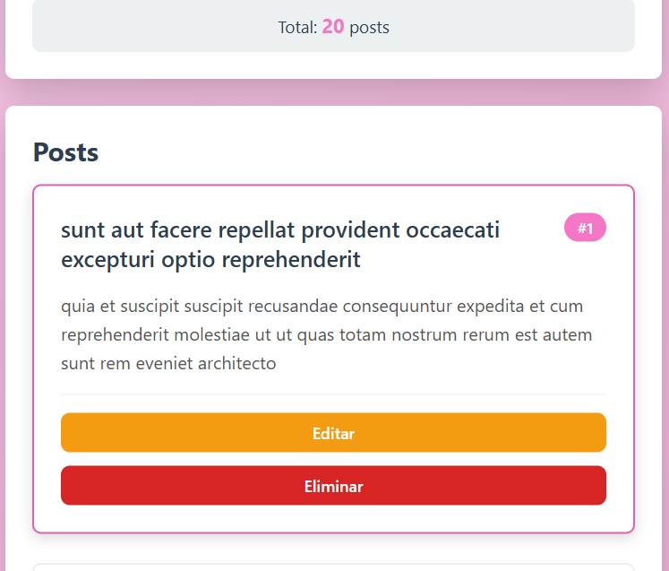
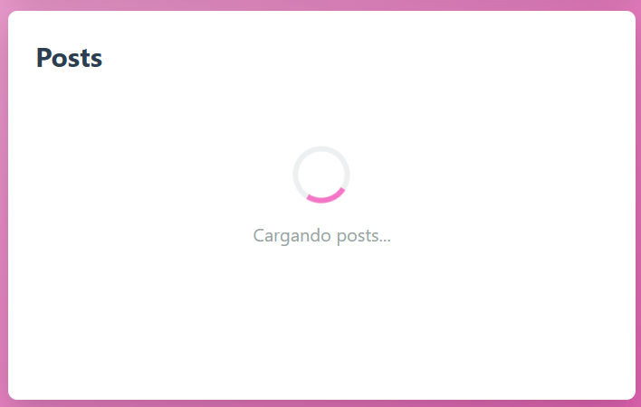
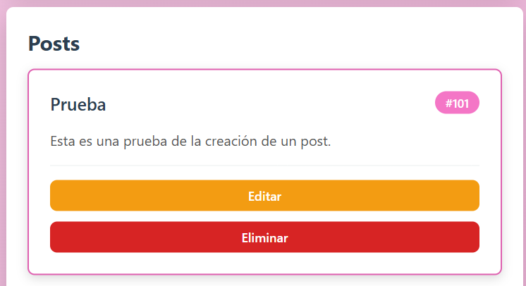
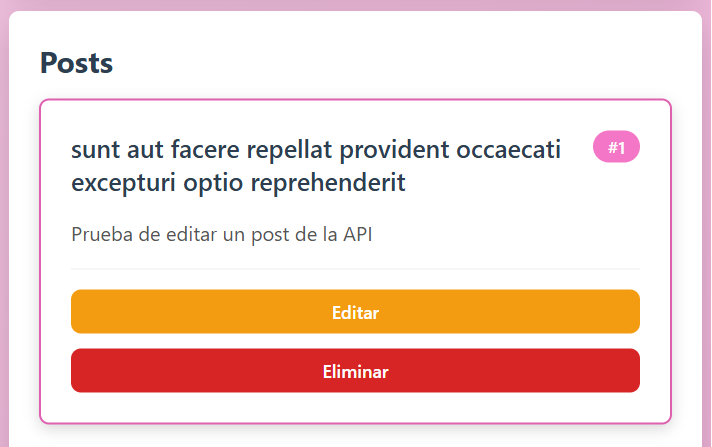
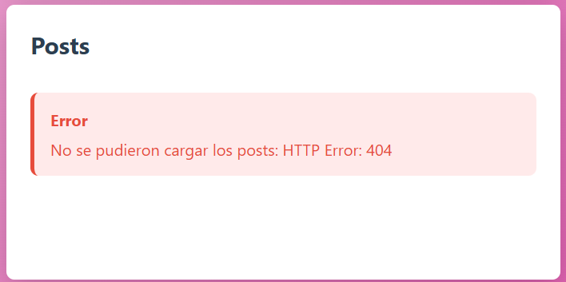
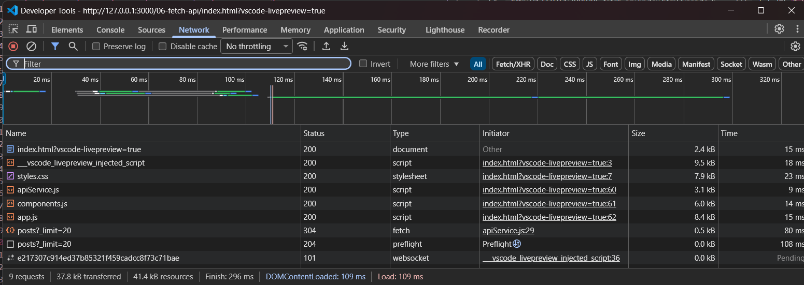
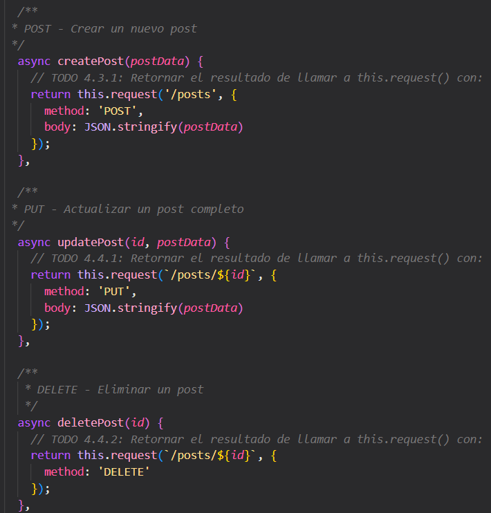
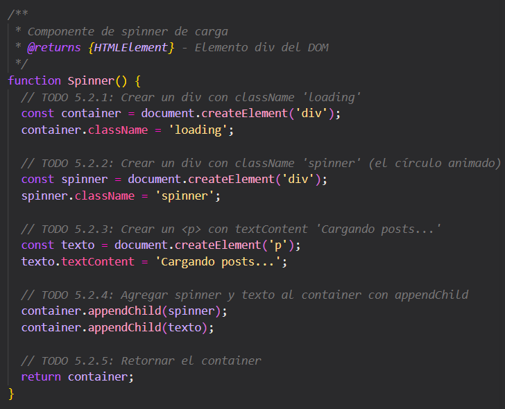

## PRÁCTICA 6
#### Carolina Fortmann

La aplicación desarrollada es un gran ejemplo de cómo funciona la generación de posts web que permite realizar operaciones básicas de un sistema CRUD utilizando HTML, CSS y JavaScript junto con el consumo de una API externa mediante Fetch API.

### Capturas de la aplicación:

#### 1- Lista cargada - Datos de la API renderizados en la pagina:


**Descripción:** Se obtienen los registros solicitados de la API, en este caso son 20 posts.

#### 2- Spinner - Estado de carga visible:


**Descripción:** Al inicializar la aplicación, el spinner muestra la carga de los datos. Es ajustable, en este caso añadí la siguiente línea de código para poder visualizarlo por unos segundos más. Esto va dentro de ```async function cargarPosts()``` en la clase ```app.js```:

```js
await new Promise(resolve => setTimeout(resolve, 3000));
```
#### 3- Crear - Formulario enviado, nuevo item en la lista:


**Descripción:** Se rellenan los campos requeridos para la creación del post, después se hace click en el botón de "Crear Post" e inmediatamente aparece el nuevo post en la parte inferior junto a los previamente cargados.


#### 4- Editar - Item modificado visible:


**Descripción:** La aplicación no actualiza los nuevos posts, solo los cargados de la API. Esto sucede porque se está usando la API pública JSONPlaceholder, que es una API de prueba y tiene solo 100 posts. Cuando se agrega un nuevo post, se observa que este se guarda con el número 101. Al querer actualizar ese nuevo post, el servidor responde con error 500, ya que ese recurso no existe realmente en el backend.
Esta API no guarda cambios reales en el servidor, sino que simula las respuestas. 
[https://jsonplaceholder.typicode.com/guide/]

#### 5- Eliminar - Item removido:


**Descripción:** Se elimina uno de los 20 posts cargados y se comprueba a través del contador, donde se muestra que ahora solo hay 19 posts.


#### 6- Error - Mensaje de error al fallar una petición:


**Descripción:** Se simula un error que refleja una URL incorrecta, arrojando un error 404 al tratar de cargar los posts.
Para realizar esta simulación, se editó la URL en ```apiService.js```:

```js
baseUrl: 'https://jsonplaceholder.typicode.com/ERROR'
```

#### 7- DevTools Network - Pestaña Network mostrando las peticiones HTTP:


**Descripción:** En DevTools (F12) > Network se observan los requests GET, POST y DELETE.

#### 8- Código - Capturas del servicio API y componentes:


**Descripcion:** La clase ```apiService.js``` es la encargada de realizar los requests a la API. La imagen muestra los bloques de código donde se implementaron: POST, PUT y DELETE.



**Descripcion:** Dentro de la clase ```components.js``` se encuentra esta función que representa un indicador visual de carga mientras se obtienen datos desde la API.
