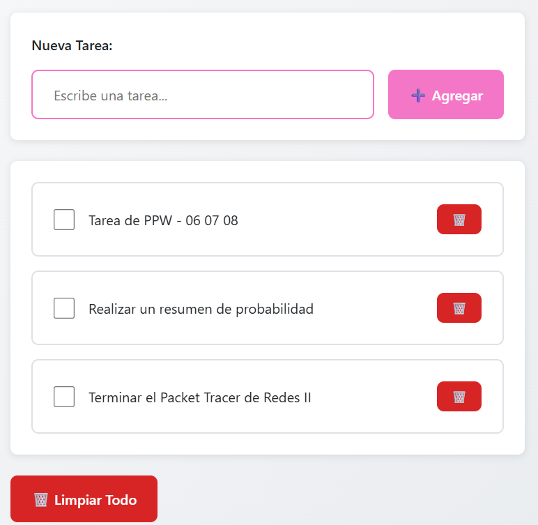
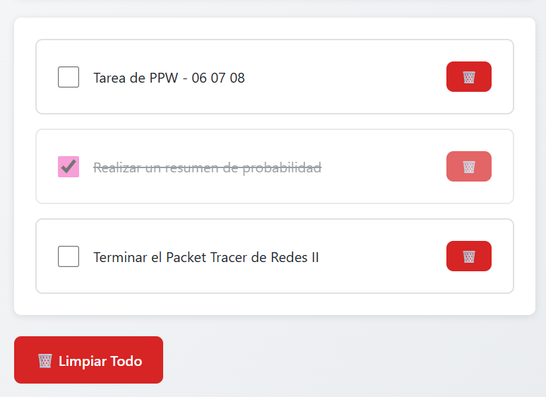
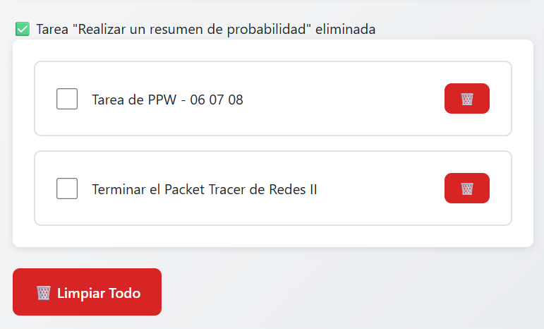
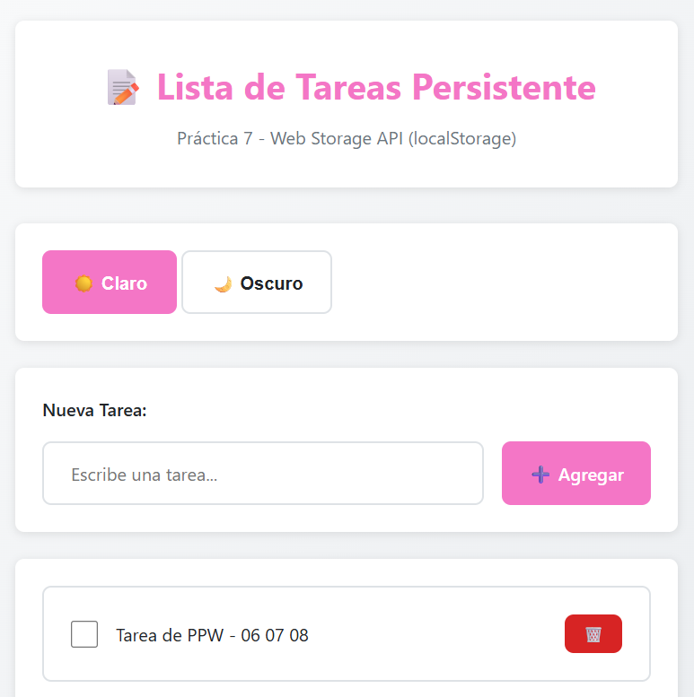
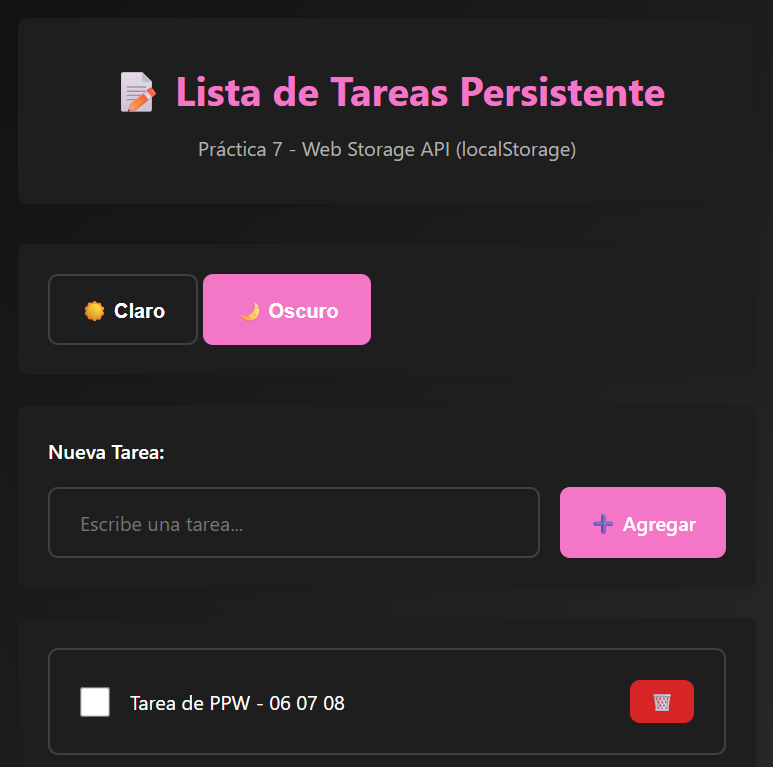
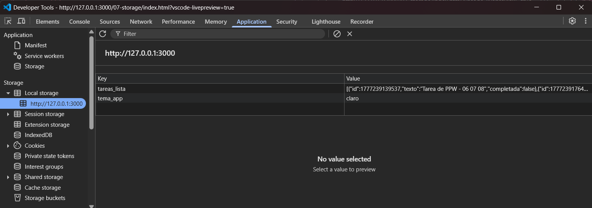
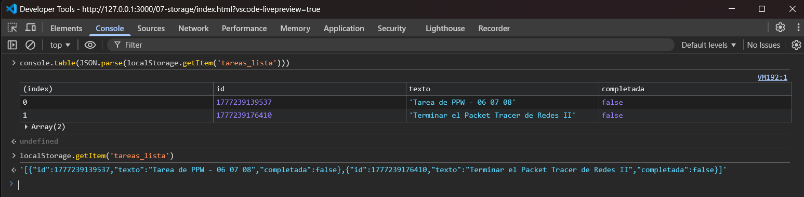
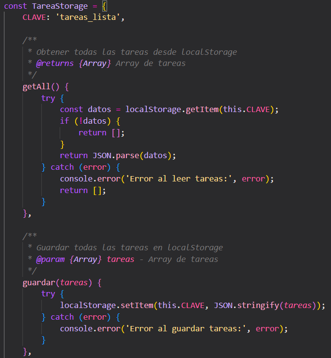

## PRÁCTICA 7
#### Carolina Fortmann
La aplicación está diseñada para organizar actividades diarias, asegurando que la información no se pierda al cerrar el navegador. Esto ocurre gracias al *LocalStorage*, cuya función al refrescar o actualizar los datos, el array de JavaScript se convierte a JSON y se almacena físicamente en el navegador.
Además la interfaz tiene 2 botones que cambian el tema de la interfaz; claro u oscuro.

### Capturas de la aplicación:

#### 1- Lista con datos - Items creados y visibles:


**Descripción:** Se agregan tareas e inmediatamente se listan en la parte inferior.

#### 2- Persistencia - Recargar pagina y verificar que los datos siguen:


**Descripción:** Se hace F5 en la página y las tareas continuan en la lista. Además se tacha una para verificar el funcionamiento.

#### 3- Eliminar - Item eliminado:


**Descripción:** Se elimina la tarea que estaba tachada usando el botón rojo de la derecha. Se muestra el mensaje temporal de confirmación.

#### 4- Tema - Al menos 2 temas diferentes aplicados:


**Descripción:** Al inicializar la página, el tema por defecto es el claro.



**Descripción:** Al hacer click en "Oscuro", la interfaz toma tonalidades oscuras. Depende de la preferencia del usuario que tema usar.

#### 5- DevTools Application - Pestaña Application > Local Storage:


**Descripción:** Al hacer F12 > Applications > Local storage, se despliega esa pequeña ventana donde se validan las dos claves principales creadas en ```storage.js``` : tareas_lista, que contiene el arreglo de objetos en formato JSON stringificado, y tema_app, que almacena la preferencia de interfaz del usuario (claro/oscuro).

#### 6- Exportar/Importar - Archivo JSON generado y datos importados:


**Descripción:**  Al hacer F12 > Console, se observa el uso del método ```JSON.parse()``` para convertir la cadena de texto recuperada del localStorage en un objeto de JavaScript.  ```console.table()``` permite visualizar de forma estructurada los datos importados, mostrando claramente los campos id, texto y el estado completada de cada tarea.


#### 7- Codigo - Capturas del servicio de Storage:


**Descripción:** Se muestra la lógica CRUD utilizando la Web Storage API. Se observa el uso de una clave única ``` tareas_lista```  y la conversión de datos mediante ``` JSON.stringify```  y ```JSON.parse``` para mantener la integridad de la lista de tareas.