## PRÁCTICA 8
#### Carolina Fortmann
La aplicación está diseñada para ingresar y validar los campos de un formulario. Se implementan diferentes métodos de validación personalizados.

### Capturas de la aplicación:

#### 1- Formulario vacio - Vista inicial:
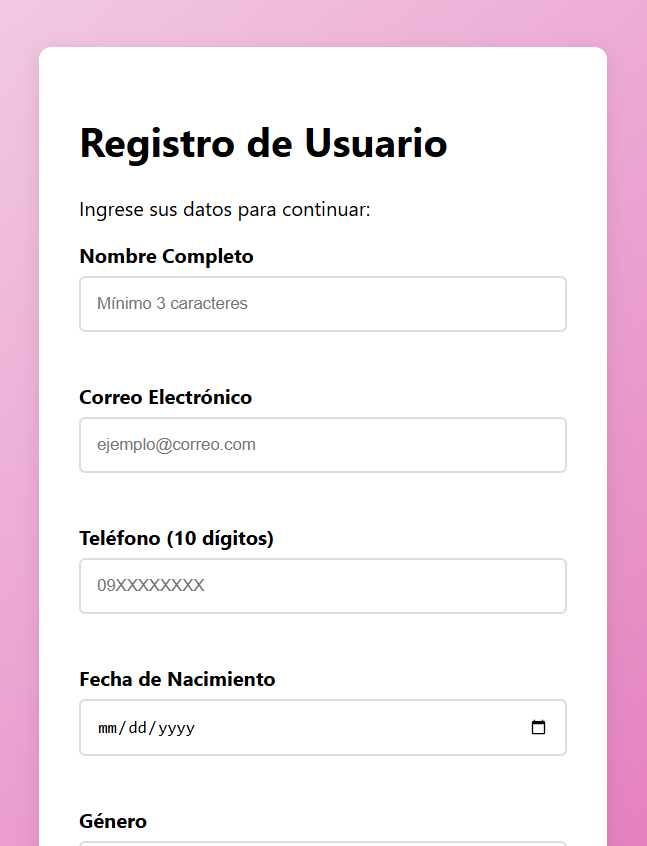

**Descripción:** Interfaz del formulario con campos vacíos.


#### 2- Errores de validacion - Campos con borde rojo y mensajes:
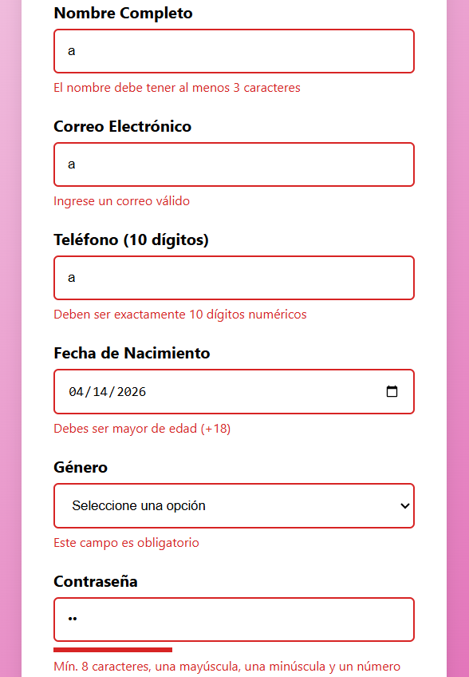

**Descripción:** Se ingresan datos erróneos en los campos para verificar ñas validaciones. Los bordes de los campos son rojos y aparecen mensajes de error, para que el usuario conozca que ingresó mal.


#### 3- Campos validos - Campos con borde verde:
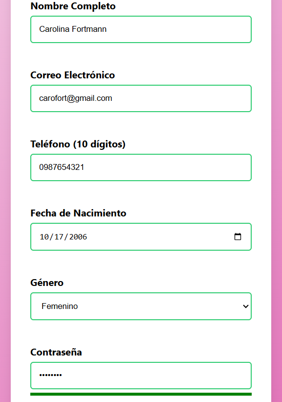

**Descripción:** Se ingresan datos correctos en los campos y se verifica la validación, por eso, ahora los bordes son verdes y no hay mensajes de error.


#### 4- Fuerza de contraseña - Indicador mostrando diferentes niveles:
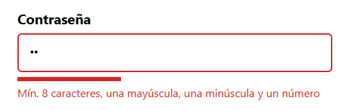

**Descripción:** Se ingresan solo dos dígitos, por lo tanto, no es una contraseña válida y la barra se muestra roja.

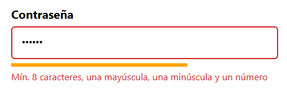

**Descripción:** Se ingresan más dígitos, pero no los solicitados, por lo tanto, la barra es naranja. 

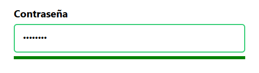

**Descripción:** Se ingresa una contraseña que cumple con los requerimientos, por lo tanto la barra es verde y el borde del campo también.

#### 5- Confirmacion password - Error cuando no coinciden:
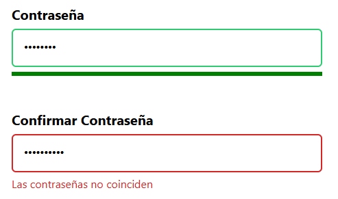

**Descripción:** Se ingresa de nuevo la contraseña, pero no coinciden. Se muestra el mensaje de error y el borde de este campo rojo.

#### 6- Envio exitoso - Mensaje de exito, datos en consola:
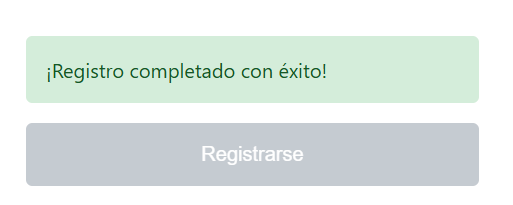

**Descripción:** Una vez el usuario llena todos los campos de forma correcta y acepta los términos y condiciones, se habilita el botón de "Registrarse". Al hacer Click sobre este: se guarda el formulario, aparece el mensaje de la imagen, se vacían los campos y se vuelve a inhabilitar el botón.

#### 7- Funcionalidad extra - Botón de registro desactivado hasta validar campos
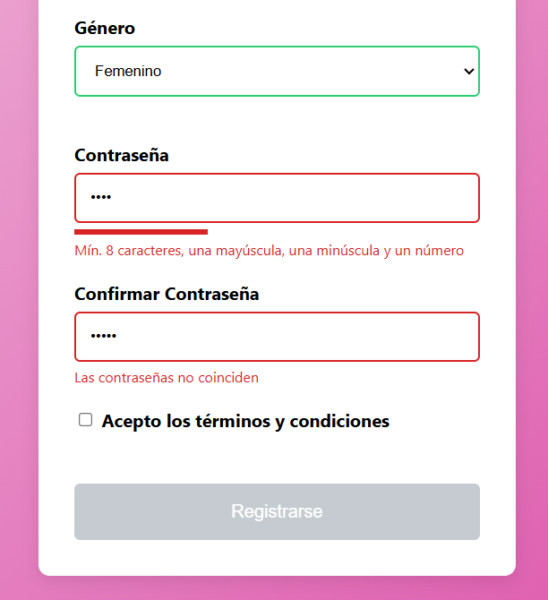

**Descripción:** La funcionalidad extra que añadí es deshabilitar el botón de registrarse hasta que el formulario este completo y validado. Esta no es solo una práctica visual, si no también intuitiva que obliga al usuario a completar correctamente los campos. Además, es una forma de evitar cualquier error cuando ingresan los datos. Esta funcionalidad se realizó en la clase ```app.js```:

``` js
function actualizarEstadoBoton() {
    let validado = true;
    const campos = form.querySelectorAll('input[required], select[required]');
    
    campos.forEach(input => {
        if (!input.classList.contains('is-valid')) {
            validado = false;
        }
    });

    btnSubmit.disabled = !validado;
}
```
#### 8- Código - Capturas de funciones de validacion:
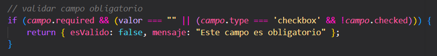

**Descripción:** Dentro de la clase ```validacion.js``` existe un objeto ```const Validacion = {}``` donde se agrupan propiedades y métodos relacionados con validación necesaria.  Dentro del objeto se encuentra la condición de la imagen, cual es la encargada de verificar si un campo obligatorio está vacío o no ha sido seleccionado, y en caso de fallo devuelve un error.

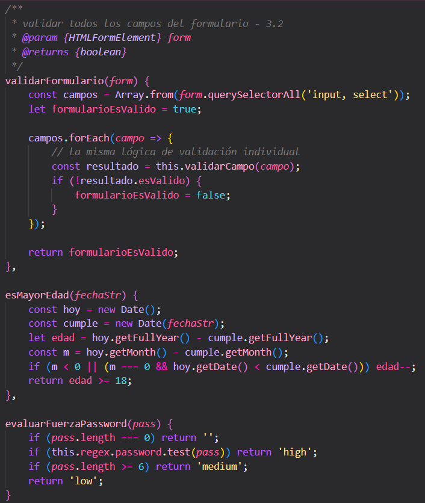

**Descripción:** En la última parte del objeto Validacion, se encuentran estos 3 métodos:

- ```validarFormulario(form)```: Recorre todos los campos del formulario y verifica uno por uno. Si alguno está mal, el formulario completo se considera inválido. Es esencial para habilitar/deshabilitar el botón de registro.

- ```esMayorEdad(fechaStr)```: Calcula la edad real de la persona y verifica si es mayor o igual a 18 años. Toma la fecha del día de hoy y convierte la fecha ingresada a tipo date. Después calcula el año (fecha actual - ingresada) y ajusta los meses, en caso que el usuario aún no haya cumplido años este año.

- ```evaluarFuerzaPassword(pass)```: Clasifica la contraseña como débil, media o fuerte según su contenido. 

